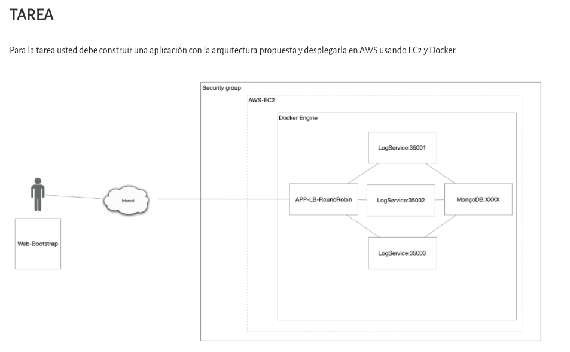
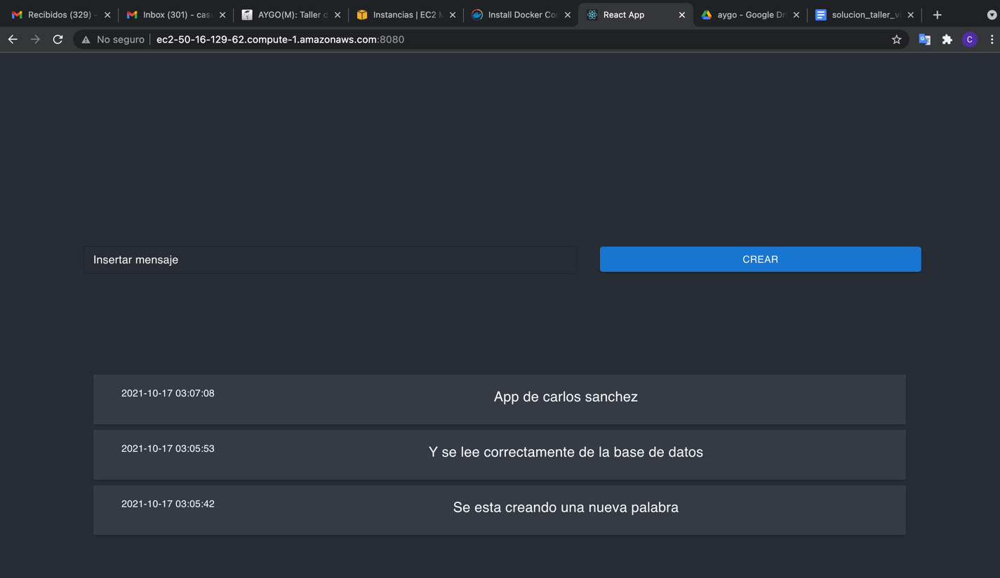
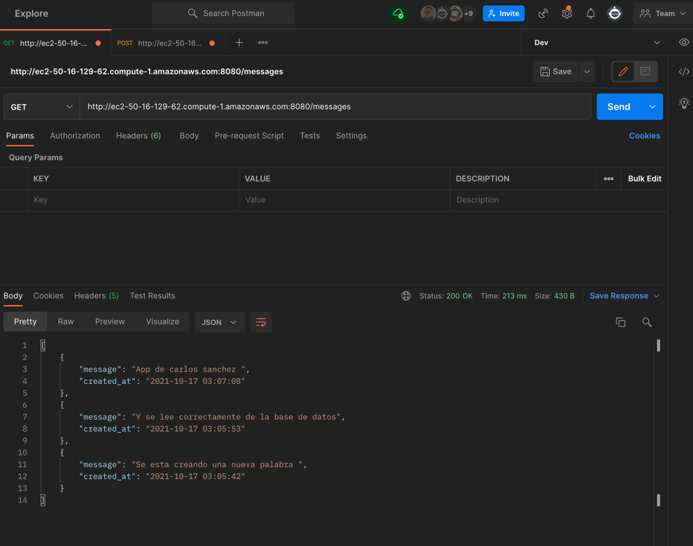
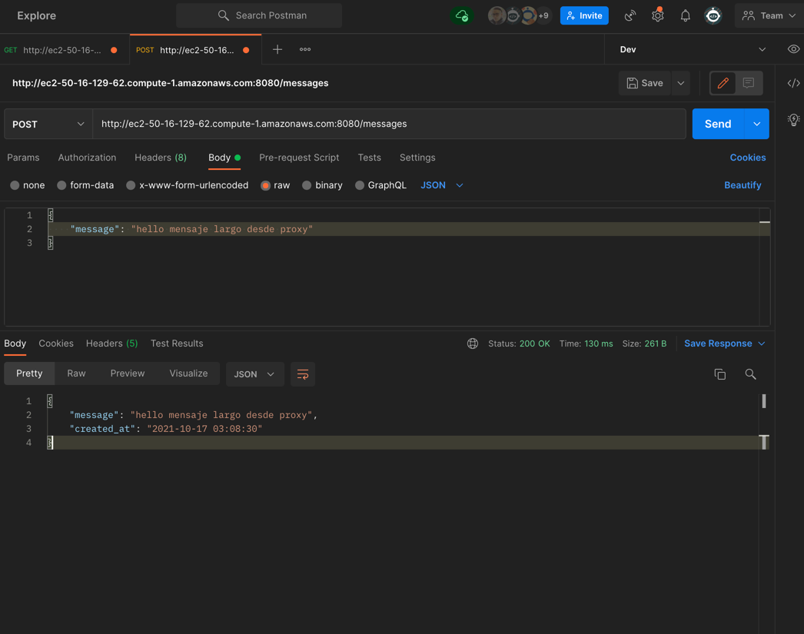

#Proyecto de virtualizacion
Se plantea una aplicacion con la siquiente arquitectura 



Para la solucion de este problema se creaton 3 sub proyectos, `virtualization-back` el cual contiene toda la logica de backend 
y conexion con la db en este caso mongo, `virtualization-lb` el cual contiene el proyecto de front buildeado como recurso
estatico y se comunica con virtualization-back para hacer forwarding de las peticiones con una logica de round-robin.
Finalmente esta `virtualization-front` el cual es una app creada en react para mostrar el front, este se comunica con
virtualization-lb para obtener la informacion

##Solucion




#Desplegar el proyecto
```
docker-compose up
```
Dicho comando ejecuta el siguiente script que tiene toda la logica y los env para levantar el app
````yaml
version: '2'

services:
  web:
    platform: linux/x86_64
    image: casvad/sparklb
    container_name: web
    ports:
      - "8080:8088"
    environment:
      PORT: 8088
      API_URLS: "http://backend1:8089,http://backend2:8089,http://backend3:8089"
  backend1:
    platform: linux/x86_64
    image: casvad/firstsparkwebapprepo
    container_name: backend1
    ports:
      - "6000:8089"
    environment:
      PORT: 8089
      MONGO_URI: "mongodb://spark:spark@db:27017"
      MONGO_DATABASE: "admin"
  backend2:
    platform: linux/x86_64
    image: casvad/firstsparkwebapprepo
    container_name: backend2
    ports:
      - "6001:8089"
    environment:
      PORT: 8089
      MONGO_URI: "mongodb://spark:spark@db:27017"
      MONGO_DATABASE: "admin"
  backend3:
    platform: linux/x86_64
    image: casvad/firstsparkwebapprepo
    container_name: backend3
    ports:
      - "6002:8089"
    environment:
      PORT: 8089
      MONGO_URI: "mongodb://spark:spark@db:27017"
      MONGO_DATABASE: "admin"
  db:
    image: mongo
    container_name: db
    ports:
      - "27017:27017"
    environment:
      MONGO_INITDB_ROOT_USERNAME: spark
      MONGO_INITDB_ROOT_PASSWORD: spark

volumes:
  mongodb:
  mongodb_config:
````

#Compilar
```
mvn clean install
```

#Correr el proyecto
```
java -cp "target/classes:target/dependency/*" co.edu.escuelaing.co.edu.escuelaing.sparkdockerdemolive.SparkWebServer
java -cp "virtualization-lb/target/classes:virtualization-lb/target/dependency/*" co.edu.escuelaing.lb.SparkWebServer
```

#Servidor
```
http:localhost:8089/hello 
```

#Correr docker-compose
```
docker-compose up -d
```

#Crear docker build 
```
 docker build --platform linux/x86_64 --tag dockersparkprimer .
```

##Docker build multiplatform (no funciona con linux/arm/v7)
Esto es para generar imagenes en multiples arquitecturas dado problema de chips mac M1, y se pushea a Dockerhub, debe estar ne las 
carpetas virtualization-back y virtualization-lib respectivamente 
```
 docker buildx build --platform linux/amd64,linux/arm64 -t casvad/firstsparkwebapprepo:latest --push .
 docker buildx build --platform linux/amd64,linux/arm64 -t casvad/sparklb:latest --push .
 ```

##Iniciar servicio docker linux
```
sudo service docker start
```